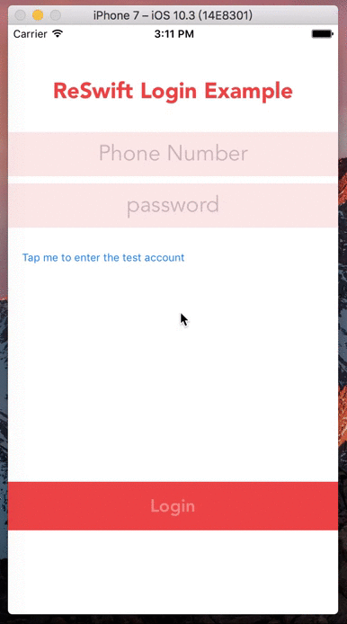

# ReSwift-RxSwift-Login-Example

An iOS Example Program Using ReSwift & RxSwift.

I'm new to [ReSwift](https://github.com/ReSwift/ReSwift) & [RxSwift](https://github.com/ReactiveX/RxSwift). Some places in this example program may not conform to the Reswift specification. Welcome to make suggestions.

### How do I get set up?

- Xcode 8
- iOS 10

run `pod install`

### Contribution

All kinds of contributions (enhancements, new features, documentation & code improvements, issues & bugs reporting) are welcome.

Before you start your contributing, please read CONTRIBUTING.md ( [English](CONTRIBUTING.md) / [中文](CONTRIBUTING.zh-cn.md) ).

### Who do I talk to?

If you have any questions, you can contact the following person,

- Repo owner wjnmailg@gmail.com

### License

ReSwift-RxSwift-Login-Example is released under an MIT license. See LICENSE for details.

